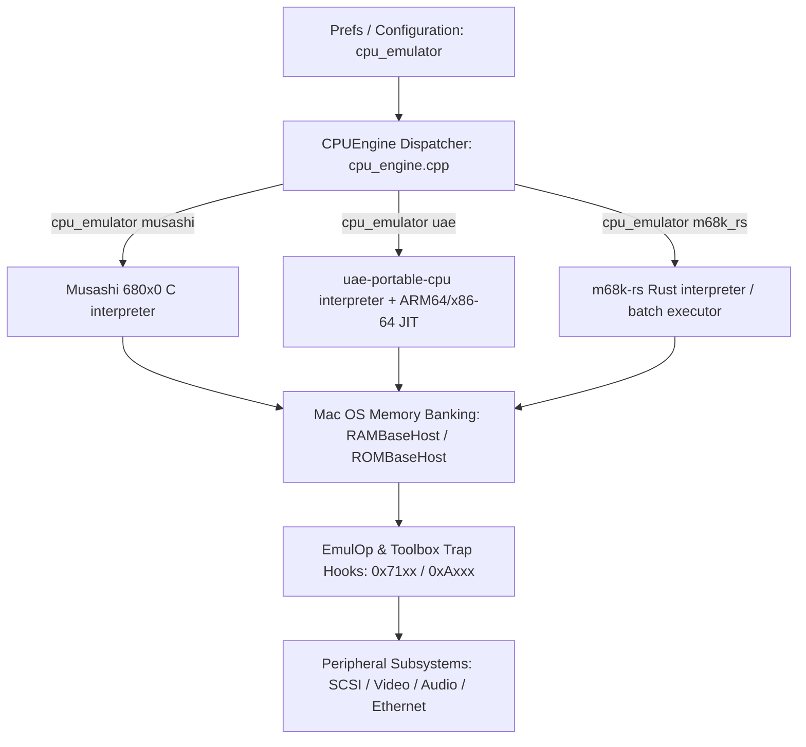

# Cockatrice III — 64-bit Port

Cockatrice III (a BasiliskII derivative) builds 64-bit only, from a single
CMake project, on macOS, Windows and Linux — AMD64 and ARM64 on each, all on
SDL. The 32-bit and PowerPC ports have been removed: the emulator reserves a
flat 4 GB window for the guest's 32-bit address space, which a 32-bit host
cannot provide, and supporting the fallback layout was the largest single
source of per-platform divergence.

The historical release notes live in [README](README) / [README.old](README.old).
This file only covers what changed to make 64-bit builds possible.

## Why this was needed

BasiliskII's 68k CPU emulator (UAE) and memory subsystem were written with the
assumption that a host pointer fits in 32 bits. Several places in the codebase
either truncated a pointer into a 32-bit UAE register or typedef'd `uintptr`
to a fixed 32-bit integer. On a 64-bit host that truncation silently drops the
top 32 bits of a real pointer, which reliably crashes or corrupts memory as
soon as the emulator touches Mac RAM/ROM above the low 4GB of address space
(or, in practice, whenever the host allocator hands back a 64-bit address, which
it always does).

## Key changes

- **`uintptr` is now a real pointer-sized integer.**
  [BasiliskII/mingw/sysdeps.h](BasiliskII/mingw/sysdeps.h) previously hardcoded
  `typedef unsigned int uintptr;` (32-bit, always). It now uses
  `typedef uintptr_t uintptr;` from `<stdint.h>`. The new
  [BasiliskII/OSX64/sysdeps.h](BasiliskII/OSX64/sysdeps.h) does the same. This
  is what `uae_cpu/memory.cpp` relies on for `RAMBaseDiff`/`ROMBaseDiff`/
  `FrameBaseDiff` to correctly round-trip a host pointer.

- **Ethernet packet delivery no longer truncates a host pointer into a
  32-bit UAE register.** [BasiliskII/SDL/sdl_pcap.cpp](BasiliskII/SDL/sdl_pcap.cpp)
  used to pass the host packet buffer address as `r.a[0] = (uint32)p + 14`,
  which loses the high bits of the pointer on 64-bit hosts. It now stashes the
  pointer out-of-band via `EtherSetPacketData()` and clears `r.a[0]`; the new
  `ether_packet_data` side channel in [BasiliskII/ether.cpp](BasiliskII/ether.cpp)
  (declared in [BasiliskII/include/ether.h](BasiliskII/include/ether.h)) is
  what `EtherReadPacket()` reads from instead of trusting the 32-bit register.
  [BasiliskII/emul_op.cpp](BasiliskII/emul_op.cpp) was updated to match the new
  `EtherReadPacket` calling convention.

- **Unaligned memory access helpers use compiler builtins instead of
  hand-rolled bit tricks.** `do_get_mem_long`/`do_put_mem_long`/etc. in
  `sysdeps.h` (mingw and OSX64) now use `__builtin_bswap32`/`__builtin_bswap16`
  and are enabled for `__x86_64__`, `__aarch64__`, `_M_X64`, and `_M_ARM64`, in
  addition to the original `__i386__`/`__powerpc__`/`__m68k__` set.

- **Fixed a real logic bug in 64-bit disk positioning.**
  [BasiliskII/disk.cpp](BasiliskII/disk.cpp) combined the high and low 32 bits
  of a 64-bit disk offset with `||` (logical OR) instead of `|` (bitwise OR),
  which is only correct by accident when the low bits happen to be non-zero.
  This is unrelated to the host architecture but was caught while auditing the
  64-bit code paths.

- **Removed other latent 32-bit assumptions:**
  - [BasiliskII/SDL/video_sdl.cpp](BasiliskII/SDL/video_sdl.cpp): `SDLscreen->pixels`
    is a `void*`; pointer arithmetic on it now casts to `uint8*` first (this
    silently "worked" via GCC's non-standard `void*` arithmetic extension, but
    fails to compile with a strict/newer Clang toolchain).
  - [BasiliskII/dummy/audio_dummy.cpp](BasiliskII/dummy/audio_dummy.cpp):
    `audio_sample_rates` changed from `uint32` to `int32` to match the
    signature expected elsewhere.
  - [BasiliskII/dummy/user_strings_dummy.cpp](BasiliskII/dummy/user_strings_dummy.cpp)
    and [BasiliskII/dummy/cdrom_dummy.cpp](BasiliskII/dummy/cdrom_dummy.cpp):
    `const`-correctness and `bool`/`FALSE` cleanups needed by modern
    C++ compilers (Clang/GCC 8+) that reject the old code as ill-formed or
    warn it into a build failure under `-Werror`-adjacent settings.
  - [BasiliskII/SDL/main_sdl.cpp](BasiliskII/SDL/main_sdl.cpp): Windows header
    includes changed from backslash (`SDL\SDL.h`) to forward-slash (`SDL/SDL.h`)
    paths, since MSYS2/MinGW toolchains don't treat `\` as a path separator in
    `#include`. DrMinGW crash-handler integration (`exchndl.h`, `ExcHndlInit()`)
    is now gated to 32-bit x86 (or an explicit `USE_EXCHNDL` define) since
    DrMinGW doesn't support x64/ARM64.
  - [BasiliskII/mingw/config.h](BasiliskII/mingw/config.h): `SIZEOF_VOID_P` /
    `SIZEOF_CHAR_P` are now computed correctly (8 on `_WIN64`/`__x86_64__`/
    `__aarch64__`, 4 otherwise) instead of being hardcoded for 32-bit.

## Building

One CMake project covers every host. The per-port build trees
(`BasiliskII/OSX64`, `BasiliskII/mingw`, the autotools tree in
`BasiliskII/Unix`, and the MSVC project in `BasiliskII/windows`) are gone.

```
cmake -S . -B build -DCMAKE_BUILD_TYPE=Release
cmake --build build -j8

ctest --test-dir build -L gate --output-on-failure   # must pass
ctest --test-dir build -L cpu  --output-on-failure   # engine accuracy, reported
```

On macOS, [scripts/build-macos.sh](scripts/build-macos.sh) wraps that up for
day-to-day work (`--debug`, `--asan`, `--bundle`, `--run`, `--clean`,
`--arch x86_64`); `--help` lists them all. Release and CI artifacts come from
[scripts/ci-osx-build.sh](scripts/ci-osx-build.sh) instead, which also handles
the universal `lipo` and packaging.

Dependencies: SDL 1.2 (`sdl12-compat` is fine — Homebrew, MSYS2 or
`libsdl1.2-compat-dev`), a C/C++17 toolchain, and `cargo` for the m68k-rs
engine (`-DCOCKATRICE_ENABLE_M68K_RS=OFF` to skip it). libpcap is needed for
its headers only; the library itself is `dlopen`'d at runtime. Windows uses
the vendored pcap headers in `BasiliskII/platform/windows/pcap`.

### Layout

- `BasiliskII/platform/<darwin|windows|linux>/` — the per-host `config.h`, and
  the three symbols each host must supply (`MenuBar_Init`, `MenuBar_UpdateAll`,
  `MenuBar_ShowOpenFileDialog`). Everything else is shared.
- `BasiliskII/platform/sysdeps.h` — one shared header for all six
  configurations, replacing the three near-identical per-port copies.
- `BasiliskII/SDL/` — the shared SDL layer, including a single
  `user_strings_sdl.*` (the old per-port copies were byte-identical).
- `BasiliskII/vendor/` — `musashi`, `m68k-rs` and `uae-portable-cpu`.

### macOS bundles and the universal binary

`cmake --build build --target bundle` wraps the binary into
`CockatriceIII.app` with a generated `Info.plist`
(`-DCOCKATRICE_BUNDLE_VERSION=x.y.z` sets `CFBundleVersion` and
`CFBundleShortVersionString`), copies in the app icon, and ad-hoc codesigns it.
The JIT entitlement is not optional: without `com.apple.security.cs.allow-jit`
the translated-code mapping cannot be made executable under Hardened Runtime.
`main_sdl.cpp` falls back to `Contents/Resources` for the ROM (via
`_NSGetExecutablePath`) when it isn't found relative to the working directory,
so a bundled ROM is found however the app was launched.

Universal binaries are built as two separate configurations joined with `lipo`,
not via `CMAKE_OSX_ARCHITECTURES="arm64;x86_64"` — the vendored CPU core links
a symbol-isolated object, which admits only one architecture per build, so the
top-level `CMakeLists.txt` refuses a multi-arch configuration outright.
[scripts/ci-osx-build.sh](scripts/ci-osx-build.sh) (`arm64`, `amd64` or
`universal`) does this and is exactly what CI runs. The Intel slice links the
committed prefix in [`dist/dependencies/osx/intel`](dist/dependencies/osx)
(rebuild with `dist/dependencies/osx/rebuild-intel-sdl.sh`); CI never compiles
SDL from source.

## CI: GitHub Actions

[.github/workflows/build-and-release.yml](.github/workflows/build-and-release.yml)
builds all six targets on every push, on pull requests into `main`, and on
`v*` tags (which also cuts a GitHub Release):

| Target        | Runner                                     |
|---------------|--------------------------------------------|
| osx-arm       | macos-latest (Apple Silicon, native arm64) |
| osx-amd64     | macos-latest (Apple Silicon, cross x86_64) |
| osx-universal | macos-latest (Apple Silicon, lipo fat)     |
| win-x64       | windows-latest (MINGW64)                   |
| win-arm64     | windows-11-arm (CLANGARM64)                |
| linux-x64     | ubuntu-latest                              |
| linux-arm64   | ubuntu-24.04-arm                           |

Every target builds with the same two CMake commands; there are no per-target
build directories any more. `win32-x86` was dropped with 32-bit support.

Reproduce a macOS CI job on an Apple Silicon machine with
[scripts/ci-osx-build.sh](scripts/ci-osx-build.sh) (`arm64`, `amd64`, or
`universal`). That script is what the workflow runs.

Each job packages its build (`.dmg` on macOS, `.zip` on Windows) alongside the
files in [dist/](dist/) and uploads it as a build artifact; on a version tag
the artifacts from all targets are attached to a single GitHub Release. Each
macOS `.dmg` carries both the flat `CockatriceIII` binary and a double-
clickable `CockatriceIII.app` bundle (built via `make app` /
`make app-universal` in `BasiliskII/OSX64`, ROM baked into
`Contents/Resources` at build time), each with its own copy of
prefs/xpram/archive from `dist/`.

The workflow triggers on push to **any** branch (not just `main`), so pushing
a feature/port branch like `osx-arm` runs the full build matrix without
needing to merge first.

## Multi-Engine 680x0 CPU Architecture

Cockatrice III features a modular CPU engine abstraction layer (`CPUEngine`), allowing seamless switching between different 680x0 execution engines. `musashi` is always built in; `uae` and `m68k_rs` are optional (`-DCOCKATRICE_ENABLE_UAE=OFF` / `-DCOCKATRICE_ENABLE_M68K_RS=OFF`). Requesting `uae` or `m68k_rs` on a build that doesn't have it is a hard failure at startup rather than a silent fallback to Musashi; any other unrecognized value falls back to Musashi with a warning.

> The earlier `syn68k` and `emu68` backends (and the classic Mac-only build path) were retired; `m68k_rs` is their replacement as the third engine.



### Available CPU Engines

1. **`musashi`** (Default): Portable, cycle-accurate C interpreter (Musashi 4.5+), hardcoded to 68040 in this port. No translator — the `jit`/`jitfpu` prefs are ignored on this engine.
2. **`uae`**: [uae-portable-cpu](https://github.com/ObsoleteMadness/uae-portable-cpu), a GPL-2 WinUAE-derived 680x0 core vendored at `BasiliskII/vendor/uae-portable-cpu` and driven through its public `uae_cpu_*` API — cycle-accurate interpreter, or with `jit true` its ARM64/x86-64 compemu JIT — with SoftFloat 68881/68882/68040 FPU. Follows Apple's W^X rule on Apple Silicon (one `MAP_JIT` region toggled with `pthread_jit_write_protect_np`). It replaced the GPL-3 Amiberry engine and took over the `uae` engine id, so existing prefs files keep working. Its JIT currently runs in handler mode rather than direct memory; see the comment in `BasiliskII/cpu/uae_cpu_glue.cpp` for what is and isn't understood about that.
3. **`m68k_rs`**: [m68k-rs](https://github.com/benletchford/m68k-rs), a Rust 680x0 core vendored as a static library (`BasiliskII/vendor/m68k-rs`, glued in via `BasiliskII/cpu/m68k_rs_glue.cpp`). Runs as a cycle-accurate interpreter by default; `jit true` switches it to a decoded-op batch executor with an optional direct-RAM "fastmem" window (`m68k_rs_fastmem`). Requires Rust 1.93+ to build (`cargo`, see [docs/cpu-engine-m68k-rs.md](docs/cpu-engine-m68k-rs.md)); passes the same 68k opcode-battery test suite as Musashi (118/122 checks — four Musashi BCD/CHK2/CMP2 fixtures are intentionally skipped due to modeling differences).

### Configuration

Set the active CPU core in your `CockatriceIII_Prefs` file. The first one found wins, searched in this order (the current directory is not searched):

1. The directory holding the executable (all platforms).
2. macOS only: `CockatriceIII.app/Contents/Resources/`.
3. The per-user location: `%APPDATA%\CockatriceIII\CockatriceIII_Prefs` (Windows), `~/Library/CockatriceIII/CockatriceIII_Prefs` (macOS), `~/.CockatriceIII_Prefs` (Linux).

If none exists, defaults are written to the per-user location. A relative `rom` path is searched for in the same three places (step 3 is `~/<rom>` on Linux); an absolute path is used as given. The chosen prefs file and ROM are printed at startup. See `BasiliskII/include/host_paths.h`.

```text
cpu_emulator uae      # Options: musashi (default), uae, m68k_rs
jit true              # Enable JIT/batch execution (uae, m68k_rs only; ignored by musashi)
jitfpu true           # Also JIT-compile FPU instructions (requires jit true)
jitcachesize 8192     # JIT/translation cache size in KB (default: 2048 KB)
m68k_rs_fastmem off   # m68k_rs only: off (default) | ram | multi | legacy direct-RAM window
```

## ROM and Resource Patching

Basilisk II boots a real Mac ROM image rather than emulating one, so hardware probes that would
hang or crash against nothing are patched out and a handful of routines are redirected to host
code (`EmulOp()`, `0x71xx`). That happens in two passes:

1. **ROM patches** (`PatchROM()` → `patch_rom_32()` / `patch_rom_classic()` in
   [BasiliskII/rom_patches.cpp](BasiliskII/rom_patches.cpp)) mutate the loaded ROM image once,
   before `Start680x0()` runs any 68k code.
2. **Resource patches** (`CheckLoad()` in [BasiliskII/rsrc_patches.cpp](BasiliskII/rsrc_patches.cpp))
   run every time the System loads a ROM/System resource, via a stub spliced into the ROM's own
   `jCheckLoad` hook (`$07F0`) — this is how patches reach System-file code that doesn't ship in
   the ROM at all (Time Manager, ADB, SCSI, Sound, LocalTalk).

This branch reworked both passes for safety and traceability, largely by cross-referencing Apple's
own **SuperMario** ROM source tree to find out what each patched routine actually does. See
[docs/rom-patches-vs-supermario.md](docs/rom-patches-vs-supermario.md) for the full per-patch
mapping and [docs/basilisk-ii-boot-and-patch.md](docs/basilisk-ii-boot-and-patch.md) for the
end-to-end boot call graph.

### Fail loudly instead of silently corrupting memory

- Every ROM patch attempt is recorded and printed (`[ROM-PATCH] name @ offset` or `MISSED`), and
  every resource patch likewise (`[RSRC-PATCH] ...`); both logs are now flushed immediately after
  each line instead of sitting in a block-buffered `stdout` that could be lost if the process died
  before exit.
- The handful of ROM patches that target a bare fixed offset (`0x1142`, `0x1b8f4`, `0x9bc4`,
  `0xa296`, `0xb2c6a`, `0xb2d2e`, `0x5b78`, …) now verify the instruction bytes they expect to
  overwrite first, and fail with a named `VERIFY FAILED` instead of scribbling over unrelated code
  when a ROM's layout doesn't match.
- Trap-table lookups (`find_rom_trap()`) return 0 for both "trap not implemented" and "trap not
  found" — every required call site now goes through `require_rom_trap()`, which treats a miss as
  a hard failure instead of writing a patch over the ROM header.
- Two fixed-offset resource patches with no signature to search for (`'sift'`/`'thng' -16563`,
  the Sound Manager audio-component patches, and `'ltlk' 0`) used to write unconditionally; a
  truncated resource meant a heap overwrite past the end of its handle rather than a missed patch.
  They now check the resource size first and log a miss instead.
- Two real out-of-bounds scans were found and fixed under AddressSanitizer: `find_rsrc_data()`
  underflowed its unsigned bound when a resource was shorter than the signature being searched
  for, and `patch_idle_time()` could scan before the start of its buffer.

### Preferring Apple's own install mechanisms over raw byte patches

Where SuperMario shows a documented, ROM-version-independent way to install something, Cockatrice
now uses it instead of guessing a byte offset — but only where the timing allows it:

- **`InstallRuntimeTraps()`** installs `Microseconds`, `PowerOff`, and `ADBOp` at runtime via
  `_SetOSTrapAddress` from a small stub block allocated in the System heap — the same
  `leaResident` / `_SetTrapAddress` idiom Apple's own Time Manager patch uses — rather than
  overwriting the ROM's copy of each trap. This only works for traps confirmed, by instrumenting a
  real boot, to not be called before `InstallDrivers()` runs (the trap dispatcher has to exist
  first). `BlockMove`, `InsTime`, `SCSIDispatch`, and `CheckLoad` are called earlier and must
  remain ROM patches.
- **`InstallVBLHandler()`** takes over the 60 Hz VBL interrupt through the ROM's own `jVBLInt`
  vector (`Lvl1DT+4`, low-memory `$196`) instead of overwriting a hardcoded ROM offset. The ROM
  continuation address is read out of the vector the ROM itself installed, rather than assumed,
  and the site is byte-verified before anything is written. The VIA1 level-1 dispatcher at
  `0x9bc4` is still a forced byte patch — Cockatrice has no emulated VIA1 to compute a real
  IFR/IER pending-interrupt mask from, so the value has to be hardcoded regardless of mechanism.

### Golden-manifest regression coverage

- `basilisk_patches_test` (`BasiliskII/tests`) replays the ROM patch pass and checks it against a
  fixture manifest (`tests/basilisk/fixtures/quadra800_patches.txt`); that manifest has itself
  been cross-checked against a real Musashi boot to `HasMacStarted` (57 of 59 records identical,
  two expected differences documented in
  [docs/rom-patches-vs-supermario.md](docs/rom-patches-vs-supermario.md)).
- `basilisk_rsrcpatch_test` links the real `CheckLoad()` into the test suite for the first time
  (it was previously stubbed out entirely) and drives it with synthetic resources built from the
  actual Apple ROM source sequences, run under AddressSanitizer.

## Preferences Reference

New preference keys added on this branch, on top of the existing BasiliskII set (`ramsize`,
`screen`, `rom`, `ether`, `bootdrive`, …):

| Key | Type | Default | Effect |
|-----|------|---------|--------|
| `cpu_emulator` | string | `musashi` | Active 680x0 engine: `musashi`, `uae`, or `m68k_rs`. See [Multi-Engine 680x0 CPU Architecture](#multi-engine-680x0-cpu-architecture). |
| `jit` | bool | `false` | Enable JIT / batch execution. No effect on `musashi`. |
| `jitfpu` | bool | `false` | Also JIT-compile FPU instructions. Requires `jit true`; forced off otherwise. |
| `jitcachesize` | int32 | `2048` | JIT/translation cache size, in KB. |
| `m68k_rs_fastmem` | string | `off` | `m68k_rs` only: `off`, `ram`, `multi`, or `legacy` direct-RAM window. |
| `dump_memory` | bool | `false` | On an unhandled guest System Error, write a binary RAM snapshot to `dump_file` before halting. Engine-independent. |
| `dump_file` | string | `/tmp/memory.bin` | Output path for the `dump_memory` crash snapshot. |
| `scsi_debug` | bool | `true` | Verbose SCSI and CD-ROM logging. |
| `toolbox_hooks` | bool | `false` | Master switch for the Toolbox trap-hook registry (`toolbox_traps.cpp`). Required by the menu bar bridge and window mirroring below; off by default because it patches guest trap vectors at boot. |
| `mdi_windows` | bool | `false` | **Experimental.** Mirror each guest Mac OS window into its own host window instead of one flat framebuffer. Requires `toolbox_hooks true`. |
| `window_redirect` | bool | `false` | **Experimental.** Give each mirrored window its own offscreen pixel buffer, so covered windows don't show whatever is on top of them. Off is the more compatible mode. |
| `native_alerts` | bool | `false` | **Experimental.** Rebuild guest alert/dialog boxes as native host controls instead of mirroring their pixels. |

`cpu` (the old numeric CPU-type preference) is still accepted for prefs-file compatibility but is
unused: the CPU model is hardcoded to 68040.

## Experimental: Toolbox Trap Hooks and Guest UI Integration

Behind `toolbox_hooks` (off by default) is a registry that installs Toolbox trap trampolines at
boot (`BasiliskII/toolbox_traps.cpp`, `BasiliskII/include/toolbox_traps.h`) so portable code can
hook specific `_A-line` traps without patching the ROM. Two subsystems build on it today:

- **Guest menu bar bridge** (`BasiliskII/toolbox_menu.cpp`) snapshots the guest `MenuList` and
  rebuilds the native macOS menu bar (`NSApp.mainMenu`) from it via
  `BasiliskII/bridge/darwin/macos_menu_bridge.mm`, so the emulated Mac's own menus appear as a
  real host menu bar. A from-scratch Classic-style (Chicago/Platinum, host-composited) menu bar
  is designed but not yet implemented — see [docs/classic-menu-bar-compositor.md](docs/classic-menu-bar-compositor.md).
- **Guest window mirroring** (`BasiliskII/toolbox_window.cpp`,
  `BasiliskII/bridge/darwin/macos_window_bridge.mm`) turns each Mac OS window into a real host
  `NSWindow` with native chrome, so a Classic application can look native while its content
  stays authentically Classic. Controlled by `mdi_windows`, `window_redirect`, and
  `native_alerts` above. Status: **experiment, Phase 1 working**, with known limitations around
  overlapping/redirected windows, desk accessories, and window-kind detection — see
  [docs/guest-window-mirroring.md](docs/guest-window-mirroring.md) for the full design writeup,
  debugging aids (`COCKATRICE_WINDOW_DUMP`, `COCKATRICE_WINDOW_SELFTEST`), and known limitations.

