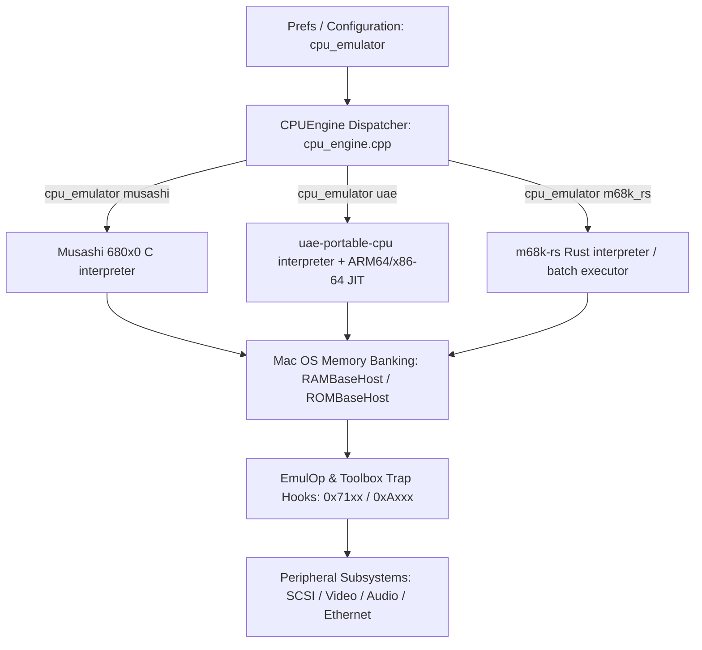

# Cockatrice III — 64-bit port changes

Cockatrice III (a Basilisk II derivative) builds 64-bit only, from a single
CMake project, on macOS, Windows and Linux — AMD64 and ARM64 on each, all on
SDL. The 32-bit and PowerPC ports have been removed: the emulator reserves a
flat 4 GB window for the guest's 32-bit address space, which a 32-bit host
cannot provide, and supporting the fallback layout was the largest single
source of per-platform divergence.

The historical release notes live in [README](../README) /
[README.old](../README.old).

## Why this was needed

Basilisk II's 68k CPU emulator (UAE) and memory subsystem were written with the
assumption that a host pointer fits in 32 bits. Several places in the codebase
either truncated a pointer into a 32-bit UAE register or typedef'd `uintptr`
to a fixed 32-bit integer. On a 64-bit host that truncation silently drops the
top 32 bits of a real pointer, which reliably crashes or corrupts memory as
soon as the emulator touches Mac RAM/ROM above the low 4 GB of address space
(or, in practice, whenever the host allocator hands back a 64-bit address, which
it always does).

## Key changes

These were made while the per-port build trees (`BasiliskII/mingw`,
`BasiliskII/OSX64`) still existed. Those trees have since been folded into the
single CMake project, and their `sysdeps.h` / `config.h` into
[BasiliskII/platform/sysdeps.h](../BasiliskII/platform/sysdeps.h) and
`BasiliskII/platform/<host>/config.h`.

- **`uintptr` is a real pointer-sized integer.** The old Windows `sysdeps.h`
  hardcoded `typedef unsigned int uintptr;` (32-bit, always). It now uses
  `typedef uintptr_t uintptr;` from `<stdint.h>`, which is what the memory
  subsystem relies on to round-trip a host pointer.

- **Ethernet packet delivery no longer truncates a host pointer into a
  32-bit UAE register.** [BasiliskII/SDL/sdl_pcap.cpp](../BasiliskII/SDL/sdl_pcap.cpp)
  used to pass the host packet buffer address as `r.a[0] = (uint32)p + 14`,
  which loses the high bits of the pointer on 64-bit hosts. It now stashes the
  pointer out-of-band via `EtherSetPacketData()` and clears `r.a[0]`; the
  `ether_packet_data` side channel in [BasiliskII/ether.cpp](../BasiliskII/ether.cpp)
  (declared in [BasiliskII/include/ether.h](../BasiliskII/include/ether.h)) is
  what `EtherReadPacket()` reads from instead of trusting the 32-bit register.
  [BasiliskII/emul_op.cpp](../BasiliskII/emul_op.cpp) was updated to match the
  new `EtherReadPacket` calling convention.

- **Unaligned memory access helpers use compiler builtins instead of
  hand-rolled bit tricks.** `do_get_mem_long`/`do_put_mem_long`/etc. use
  `__builtin_bswap32`/`__builtin_bswap16` and `memcpy()`, which every supported
  compiler lowers to a single load or store plus a byte reverse.

- **Fixed a logic bug in 64-bit disk positioning.**
  [BasiliskII/disk.cpp](../BasiliskII/disk.cpp) combined the high and low 32 bits
  of a 64-bit disk offset with `||` (logical OR) instead of `|` (bitwise OR),
  which is only correct by accident when the low bits happen to be non-zero.
  This is unrelated to the host architecture but was caught while auditing the
  64-bit code paths.

- **Removed other latent 32-bit assumptions:**
  - [BasiliskII/SDL/video_sdl.cpp](../BasiliskII/SDL/video_sdl.cpp): `SDLscreen->pixels`
    is a `void*`; pointer arithmetic on it now casts to `uint8*` first (this
    silently "worked" via GCC's non-standard `void*` arithmetic extension, but
    fails to compile with a strict/newer Clang toolchain).
  - [BasiliskII/dummy/audio_dummy.cpp](../BasiliskII/dummy/audio_dummy.cpp):
    `audio_sample_rates` changed from `uint32` to `int32` to match the
    signature expected elsewhere.
  - [BasiliskII/dummy/user_strings_dummy.cpp](../BasiliskII/dummy/user_strings_dummy.cpp)
    and [BasiliskII/dummy/cdrom_dummy.cpp](../BasiliskII/dummy/cdrom_dummy.cpp):
    `const`-correctness and `bool`/`FALSE` cleanups needed by modern
    C++ compilers (Clang/GCC 8+) that reject the old code as ill-formed.
  - [BasiliskII/SDL/main_sdl.cpp](../BasiliskII/SDL/main_sdl.cpp): Windows header
    includes changed from backslash (`SDL\SDL.h`) to forward-slash (`SDL/SDL.h`)
    paths, since MSYS2/MinGW toolchains don't treat `\` as a path separator in
    `#include`. DrMinGW crash-handler integration (`exchndl.h`, `ExcHndlInit()`)
    is gated to 32-bit x86 (or an explicit `USE_EXCHNDL` define) since
    DrMinGW doesn't support x64/ARM64.
  - `SIZEOF_VOID_P` / `SIZEOF_CHAR_P` are computed correctly (8 on
    `_WIN64`/`__x86_64__`/`__aarch64__`) instead of being hardcoded for 32-bit.

## Source layout

- `BasiliskII/platform/<darwin|windows|linux>/` — the per-host `config.h`, and
  the three symbols each host must supply (`MenuBar_Init`, `MenuBar_UpdateAll`,
  `MenuBar_ShowOpenFileDialog`). Everything else is shared.
- `BasiliskII/platform/sysdeps.h` — one shared header for all six
  configurations, replacing the three near-identical per-port copies.
- `BasiliskII/SDL/` — the shared SDL layer, including a single
  `user_strings_sdl.*` (the old per-port copies were byte-identical).
- `BasiliskII/vendor/` — `musashi`, `m68k-rs` and `uae-portable-cpu`.

## Multi-engine 680x0 CPU architecture

Cockatrice III has a modular CPU engine abstraction layer (`CPUEngine`), allowing switching between different 680x0 execution engines. `musashi` is always built in; `uae` and `m68k_rs` are optional (`-DCOCKATRICE_ENABLE_UAE=OFF` / `-DCOCKATRICE_ENABLE_M68K_RS=OFF`). Requesting `uae` or `m68k_rs` on a build that doesn't have it is a hard failure at startup rather than a silent fallback to Musashi; any other unrecognized value falls back to Musashi with a warning.

### Available CPU engines

1. **`musashi`** (default): Portable, cycle-accurate C interpreter (Musashi 4.5+), hardcoded to 68040 in this port. No translator — the `jit`/`jitfpu` prefs are ignored on this engine.
2. **`uae`**: [uae-portable-cpu](https://github.com/ObsoleteMadness/uae-portable-cpu), a GPL-2 WinUAE-derived 680x0 core vendored at `BasiliskII/vendor/uae-portable-cpu` and driven through its public `uae_cpu_*` API — cycle-accurate interpreter, or with `jit true` its ARM64/x86-64 compemu JIT — with SoftFloat 68881/68882/68040 FPU. Follows Apple's W^X rule on Apple Silicon (one `MAP_JIT` region toggled with `pthread_jit_write_protect_np`). By default its JIT calls the memory handlers for every access; `jitdirect true` lets translated code access RAM, ROM and the framebuffer inline, which is where the remaining speed is. In that mode the ROM pages are write-protected on the host while the guest runs, so a translated store that reaches ROM is dropped (as on real hardware) instead of patching it — see the comments in `BasiliskII/cpu/uae_cpu_glue.cpp` and `memory_set_rom_write_guard()` in `BasiliskII/memory.cpp`, and [uae-portable-cpu-host-hooks.md](uae-portable-cpu-host-hooks.md).
3. **`m68k_rs`**: [m68k-rs](https://github.com/benletchford/m68k-rs), a Rust 680x0 core vendored as a static library (`BasiliskII/vendor/m68k-rs`, glued in via `BasiliskII/cpu/m68k_rs_glue.cpp`). Runs as a cycle-accurate interpreter by default; `jit true` switches it to a decoded-op batch executor with an optional direct-RAM "fastmem" window (`m68k_rs_fastmem`). Requires Rust 1.93+ to build (`cargo`, see [cpu-engine-m68k-rs.md](cpu-engine-m68k-rs.md)); passes the same 68k opcode-battery test suite as Musashi (118/122 checks — four Musashi BCD/CHK2/CMP2 fixtures are intentionally skipped due to modeling differences).

## Preferences

The port added several preference keys (`cpu_emulator`, `jit`, `jitdirect`, `jitfpu`,
`jitcachesize`, `m68k_rs_fastmem`, `ltoudp`, `dump_memory`, `dump_file`, `scsi_debug` and the
experimental `toolbox_hooks` family) and changed where the prefs file and ROM are found: the
executable's directory, the macOS bundle's `Contents/Resources`, then a per-user location, never
the current directory. Every option, the search order and the file syntax are described in
[CockatriceIII_Prefs.md](CockatriceIII_Prefs.md).

## Experimental: Toolbox trap hooks and guest UI integration

Behind `toolbox_hooks` (off by default) is a registry that installs Toolbox trap trampolines at
boot (`BasiliskII/toolbox_traps.cpp`, `BasiliskII/include/toolbox_traps.h`) so portable code can
hook specific `_A-line` traps without patching the ROM. Two subsystems build on it today:

- **Guest menu bar bridge** (`BasiliskII/toolbox_menu.cpp`) snapshots the guest `MenuList` and
  rebuilds the native macOS menu bar (`NSApp.mainMenu`) from it via
  `BasiliskII/bridge/darwin/macos_menu_bridge.mm`, so the emulated Mac's own menus appear as a
  real host menu bar. A from-scratch Classic-style (Chicago/Platinum, host-composited) menu bar
  is designed but not yet implemented — see [classic-menu-bar-compositor.md](classic-menu-bar-compositor.md).
- **Guest window mirroring** (`BasiliskII/toolbox_window.cpp`,
  `BasiliskII/bridge/darwin/macos_window_bridge.mm`) turns each Mac OS window into a real host
  `NSWindow` with native chrome, so a Classic application can look native while its content
  stays authentically Classic. Controlled by `mdi_windows`, `window_redirect`, and
  `native_alerts` above. Status: **experiment, Phase 1 working**, with known limitations around
  overlapping/redirected windows, desk accessories, and window-kind detection — see
  [guest-window-mirroring.md](guest-window-mirroring.md) for the full design writeup,
  debugging aids (`COCKATRICE_WINDOW_DUMP`, `COCKATRICE_WINDOW_SELFTEST`), and known limitations.
