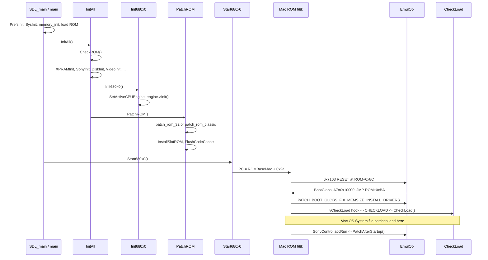

# Basilisk II Boot and Patch Process

Quick guide for humans and agents debugging Mac ROM boot in Cockatrice III
(a Basilisk II derivative). Function names below are the real symbols.

**Primary sources**

| Area | File |
|------|------|
| Host entry (macOS / Windows SDL) | `BasiliskII/SDL/main_sdl.cpp` |
| Shared init / shutdown | `BasiliskII/main.cpp` |
| ROM identification and patches | `BasiliskII/rom_patches.cpp`, `BasiliskII/include/rom_patches.h` |
| Runtime 68k host traps | `BasiliskII/emul_op.cpp`, `BasiliskII/include/emul_op.h` |
| Loaded-resource patches | `BasiliskII/rsrc_patches.cpp` |
| CPU engine dispatch | `BasiliskII/cpu_engine.cpp` |
| Memory window | `BasiliskII/memory.cpp` |
| NuBus slot declaration ROM | `BasiliskII/slot_rom.cpp` |
| Post-startup FS patches | `BasiliskII/sony.cpp` → `PatchAfterStartup()` |

Historical architecture notes (addressing modes, ILLEGAL-opcode trick) live
in `BasiliskII/docs/TECH`. This file is the Cockatrice-specific boot path.

---

## 1. What this emulator actually boots

Basilisk II does **not** emulate a full Macintosh chipset. It loads a real Mac
ROM, patches the ROM so hardware probes never run, and intercepts 68k
instructions in the `0x71xx` range (`EmulOp()`) to provide RAM, disks, video,
time, and ADB from the host.

Two ROM families are patched:

| `ROMVersion` (word at ROM+8) | Constant | Typical size | Patcher |
|------------------------------|----------|--------------|---------|
| `0x0276` | `ROM_VERSION_CLASSIC` | 256/512 KB | `patch_rom_classic()` |
| `0x067c` | `ROM_VERSION_32` | 512 KB / 1 MB | `patch_rom_32()` |

Cockatrice's current `PrefsInit()` defaults to a Quadra-class 32-bit ROM
(`rom Quadra800.rom`, `modelid 29`, `cpu 4`). Classic ROMs still have a
patch path, but the 32-bit flow is what you will almost always debug.

---

## 2. End-to-end call graph



---

## 3. Macintosh address map (Cockatrice)

Set in `SDL_main()` / `main()` **before** `InitAll()`:

| Mac address | Host pointer | Meaning |
|-------------|--------------|---------|
| `RAMBaseMac = 0` | `RAMBaseHost = Host_Mem_Base` | Mac RAM, including Low Memory Globals at `0x0000..0x1fff` |
| `ROMBaseMac = 0x40800000` | `ROMBaseHost = Host_Mem_Base + 0x40800000` | Mac ROM image |
| `MacFrameBaseMac = 0xa0000000` | `MacFrameBaseHost` | Frame buffer (Mac II path) |

`memory_init()` in `BasiliskII/memory.cpp` reserves the full 4 GB host
window (`Host_Mem_Base`) as RW dummy-backed memory up front (demand paged,
so touching a page is what actually costs RSS) rather than leaving
everything outside RAM/ROM/framebuffer `PROT_NONE`. RAM, ROM, and the
framebuffer are still tracked as their own committed ranges via
`memory_commit_range()` for `memory_is_mapped()` bookkeeping, but every
other Mac address now reads as zero instead of faulting. This is
deliberate: the JIT engines (UAE/Amiberry's `compile_block()`, Emu68's
`M68K_GetTranslationUnit()`) dereference guest pointers directly mid-
compile without going through a bank-checked accessor the way Musashi
does, and a SIGSEGV-driven `siglongjmp` out of either compiler mid-
translation left their global code-cache cursor / register-allocation
state corrupted — the root cause of the `compile_block` wild-pointer
crashes and the Emu68 stuck-refaulting loop. Real Mac hardware probes
(NuBus declaration ROM scans) are already routed around via ROM patches
(`InstallSlotROM()` / `patch_rom_32()`, §9), so nothing in the normal boot
path depends on an unmapped address raising a genuine bus error.
`Mac2HostAddr(addr)` is `Host_Mem_Base + addr`. All CPU engines share this
window. The `memory_guard_enter()` / `MEMORY_FAULT_SETJMP` / vector-2
injection path still exists as a safety net for addresses that fall
entirely outside the 4 GB window, but no longer fires for ordinary holes.

Guest boot entry used by every engine:

```
PC  = ROMBaseMac + 0x2a   // 0x4080002A
A7  = 0x2000              // temporary stack until RESET EmulOp
SR  = 0x2700              // supervisor, IPL 7
```

See `musashi_start()`, `emu68_start()`, `winuae_start()`.

---

## 4. Host startup (`SDL_main` / `main`)

Platform files: `BasiliskII/SDL/main_sdl.cpp` (current), also
`BasiliskII/Unix/main_unix.cpp`, `BasiliskII/windows/main_windows.cpp`.

Order inside `SDL_main()`:

1. `install_crash_handler()` — SIGSEGV/SIGBUS/SIGILL (and SIGSYS on Darwin JIT).
2. `PrefsInit()` — defaults then `LoadPrefs()`. Boot-related prefs:
   - `rom` — ROM file path
   - `ramsize` — rounded down to 1 MB
   - `cpu` / `fpu` / `cpu_emulator` / `jit`
   - `bootdrive` / `bootdriver` — written into XPRAM later
   - `modelid` — UniversalInfo `productKind` (default 29 = Quadra 800 display name)
3. `SysInit()` — host file/OS helpers used by disk and floppy images.
4. Optional `PrefsEditor()` unless `nogui`.
5. `RAMSize = PrefsFindInt32("ramsize") & 0xfff00000` (minimum 1 MB).
6. `RAMBaseMac = 0`, `ROMBaseMac = 0x40800000`, `memory_init()`.
7. `memset(ROMBaseHost, 0xAA, 0x100000)` then read the ROM file into `ROMBaseHost`.
   Accepted sizes: 64, 128, 256, 512, or 1024 KB. Wrong size → `STR_ROM_SIZE_ERR`.
8. `InitAll()`. Failure prints `failed to initalized. Exiting!` and `QuitEmulator()`.
9. `SDL_CreateThread(xpram_func)` and `SDL_CreateThread(tick_funcxxx)` — 60 Hz tick
   sets `INTFLAG_60HZ`.
10. `Start680x0()` — does not return until the emulator quits.
11. `QuitEmulator()` → `Exit680x0()` → `ExitAll()`.

CLI flags parsed before prefs: `-break <rom_offset>` sets `ROMBreakpoint`;
`-rominfo` sets `PrintROMInfo` (dumps resources / UniversalInfo in `PatchROM()`).

---

## 5. `InitAll()` — host subsystems before 68k execution

`BasiliskII/main.cpp`. Returns `false` on fatal error.

| Step | Function | Why it matters for boot |
|------|----------|-------------------------|
| ROM ID | `CheckROM()` | Reads `ROMVersion` from ROM+8. Unsupported type → `STR_UNSUPPORTED_ROM_TYPE_ERR` |
| CPU prefs | sets `CPUType`, `FPUType`, `TwentyFourBitAddressing` | Classic/Plus → 68000 + 24-bit; Mac II (`ROM_VERSION_II`) → 24-bit; 32-bit clean → 32-bit |
| PRAM | `XPRAMInit()` | Loads 256-byte XPRAM from disk |
| Boot volume | writes `bootdrive` / `bootdriver` to `XPRAM[0x78..0x7b]` | Default `bootdriver` is `-33` (`.Disk`) |
| Block devices | `SonyInit()`, `DiskInit()`, `SCSIInit()` | Opens disk images from `disk` prefs |
| Optional | `ExtFSInit()` | Host folder as Mac volume (stubbed in this tree) |
| I/O | `SerialInit()`, `SCCInit()`, `EtherInit()`, `TimerInit()`, `ClipInit()`, `AudioInit()` | |
| Display | `VideoInit(classic?)` | Classic = 512×342 1-bit in Mac RAM; II = NuBus framebuffer. Failure is fatal |
| CPU | `Init680x0()` | **Must succeed before `PatchROM()`** — memory accessors and engine are live |
| Patches | `PatchROM()` | Mutates the loaded ROM image in place |

`CheckROM()` currently returns a non-zero version constant even for unexpected
ROM words (it only special-cases `ROM_VERSION_32`). **`PatchROM()` is the real
rejector.** If boot dies with `Error in PatchROM()`, the ROM is the wrong
family or a byte-pattern search inside `patch_rom_32()` failed.

---

## 6. `Init680x0()` — pick a CPU engine

`BasiliskII/cpu_engine.cpp`.

1. `EnsureEnginesRegistered()` — musashi, uae (Amiberry), emu68, syn68k.
2. `PrefsFindString("cpu_emulator")` (default `"musashi"`).
3. `SetActiveCPUEngine(requested)`. `uae` / `emu68` / `syn68k` are fatal if
   missing; unknown names fall back to musashi.
4. Read `jit`, `jitfpu`, `jitcachesize`. Musashi and syn68k force `UseJIT = false`.
5. `s_active_engine->init()`.

`Start680x0()`, `Reset680x0()`, `Execute68k()`, `Execute68kTrap()`, and
`TriggerInterrupt()` all forward to that engine.

`Execute68k()` / `Execute68kTrap()` are used **during** boot from C++ (for
example `InstallDrivers()` calls `SetOSTrapAddress`, `DrvrInstallRsrvMem`,
`Open`). Nested 68k returns via opcode `M68K_EXEC_RETURN` (`0x7100`) and
`TriggerExecutionReturn()`.

---

## 7. How `0x71xx` reaches `EmulOp()`

Patched ROM and replacement drivers contain illegal `moveq` forms `0x7100..`.
Each engine intercepts them instead of taking a 68k illegal-instruction vector:

| Engine | Dispatch |
|--------|----------|
| Musashi | `musashi_illg_callback()` in `musashi_glue.cpp` |
| Emu68 | JIT trampoline `emu68_hosted_emulop()` → `emu68_emulop_dispatch()` |
| UAE | illegal-instruction path in `amiberry_glue.cpp` |

All of them:

- `0x7100` (`M68K_EXEC_RETURN`) → `TriggerExecutionReturn()` (leave `Execute68k`)
- `0x7101 .. M68K_EMUL_OP_MAX-1` → copy regs into `M68kRegisters`, call `EmulOp()`, write regs back (A7 only if it still looks like a RAM stack)

`EmulOp()` logs every opcode except the high-frequency `M68K_EMUL_OP_IRQ`
(`[EMUL-OP] Executing EmulOp 0x....`). Emu68 also prints
`[Emu68] EmulOp 0x.... at PC=...`. Use that log as a boot progress bar.

---

## 8. `PatchROM()` — mutate the ROM before PC starts

`PatchROM()`:

1. Optional `print_rom_info()` if `PrintROMInfo`.
2. `switch (ROMVersion)` → `patch_rom_classic()` or `patch_rom_32()`.
3. If `ROMBreakpoint` is set, write `M68K_EMUL_BREAK` (`0x7101`) at that ROM offset.
4. `FlushCodeCache(ROMBaseHost, ROMSize)`.

Helpers used while patching (do not run 68k yet):

| Function | Role |
|----------|------|
| `find_rom_data(start, end, bytes, len)` | Byte search in `ROMBaseHost` |
| `find_rom_resource(type, id)` | Walk ROM resource map at ROM+`0x1a` |
| `find_rom_trap(trap)` | Decode compressed trap table at ROM+`0x22` |

If a required `find_rom_data()` returns 0, `patch_rom_32()` returns `false`
and `InitAll()` aborts. Enable `DEBUG` in `rom_patches.cpp` to print the last
successful match offsets (`universal`, `init_mmu`, `sony`, …).

### 8.1 `patch_rom_classic()` (`ROM_VERSION_CLASSIC`)

Fixed offsets (Classic/SE `$0276`). Highlights:

- Skip debugger / checksum / IWM / startup sound / memory test / SCSI probe.
- `M68K_EMUL_OP_CLKNOMEM` at ClkNoMem; `M68K_EMUL_OP_INSTALL_DRIVERS` at `0x3f82a`.
- Overlay `.Sony` / `.Disk` driver stubs and serial drivers at `sony_offset = 0x34680`.
- Replace ADBOp, Time Manager traps, `SCSIDispatch`.
- Redirect `vCheckLoad()` at ROM `0xe740` through a stub that ends in
  `M68K_EMUL_OP_CHECKLOAD`.
- VIA level-1 handler patched to `M68K_EMUL_OP_IRQ`.

There is **no** `M68K_EMUL_OP_RESET` trampoline on Classic; boot is the ROM's
own 24-bit startup.

### 8.2 `patch_rom_32()` (`ROM_VERSION_32`) — main path

Search + poke. Failure of a **required** pattern search aborts PatchROM.

**Identity / hardware lie**

- Locate UniversalInfo (`0xdc000505 0x3fff0100` near `0x3400..0x3c00`). Store
  offset in `UniversalInfo`.
- Disable NuBus slots in `nuBusInfoPtr`, then `InstallSlotROM()` injects one
  fake board (video + CPU + ethernet) into the ROM.
- `productKind` ← prefs `modelid`.
- If `FPUType == 0`, `defaultRSRCs = 4` (FPU optional). Missing second
  `'PACK' 4` later prints `WARNING: This ROM seems to require an FPU`.

**Skip real hardware (the RESET trampoline)**

At ROM offset `0x8C`:

```
M68K_EMUL_OP_RESET     ; 0x7103  -> EmulOp() builds BootGlobs
JMP  ROMBaseMac+0xBA   ; skip GetHardwareInfo, VIA/SCC/IWM/SCSI/ASC init
```

Unpatched ROM+`0x2A` is typically `4EFA` (PC-relative JMP) which lands at this
RESET site. That is the first interesting 68k after `Start680x0()`.

Further NOPs / RTS patches: `GetHardwareInfo`, VIA init, `InitMMU` (three
byte searches), SCC/IWM/SCSI/ASC, `EnableExtCache`, `DisableIntSources`,
`EnableOneSecInts`, `Enable60HzInts` / parity, `EnableSlotInts`, VIA2,
NuBus probe, model-ID reads from `0x5ffffffc`.

**RAM sizing**

- `M68K_EMUL_OP_PATCH_BOOT_GLOBS` at ROM `0x10e`.
- `CompBootStack` at ROM `0x490` rewritten to compute a stack then
  `M68K_EMUL_OP_FIX_MEMSIZE`.

**Drivers and traps (still ROM bytes, not yet installed in the Unit Table)**

- ROM `0x1142` → `M68K_EMUL_OP_INSTALL_DRIVERS` (replaces `.Sound` open).
- `sony_offset = find_rom_resource('DRVR', 4)` — overwrite with `sony_driver`,
  place `disk_driver` at `+0x100`, icons at `+0x400/+0x600/+0x800`.
- `'SERD' 0` → `M68K_EMUL_OP_SERD` (currently a no-op in `InstallSERD()`).
- Trap replacements via `find_rom_trap()`:

  | Trap | Replacement |
  |------|-------------|
  | `0xa07c` ADBOp | `adbop_patch` → `M68K_EMUL_OP_ADBOP` |
  | `0xa058` InsTime | `M68K_EMUL_OP_INSTIME` |
  | `0xa059` RmvTime | `M68K_EMUL_OP_RMVTIME` |
  | `0xa05a` PrimeTime | `M68K_EMUL_OP_PRIMETIME` |
  | (follows PrimeTime) | `M68K_EMUL_OP_MICROSECONDS` (installed later with `SetOSTrapAddress`) |
  | `0xa815` SCSIDispatch | `M68K_EMUL_OP_SCSI_DISPATCH` |
  | `0xa05b` PowerOff | `M68K_EMUL_OP_SHUTDOWN` |
  | `0xa02e` BlockMove | `M68K_EMUL_OP_BLOCK_MOVE` (emulated 68k only) |

- `vCheckLoad` at ROM `0x1b8f4` JMP to stub at `sony_offset+0x300` ending in
  `M68K_EMUL_OP_CHECKLOAD`.
- `PutScrapPatch` at `sony_offset+0xc00` (activated in `INSTALL_DRIVERS`).
- VIA handlers at `0x9bc4` / `0xa296` → always 60 Hz + `M68K_EMUL_OP_IRQ`.

**68040 PTEST / SANE**

On 1 MB ROMs, `BlockMove` PTEST is NOP'd. If `FPUType == 1`, a SANE PTEST
sequence is replaced with `cpusha` + RTS so FPU ROMs do not execute `PTEST`.

---

## 9. `InstallSlotROM()` — fake NuBus board

`BasiliskII/slot_rom.cpp`. Called only from `patch_rom_32()`, after
`VideoInit()` so `VideoMonitor` is valid.

Builds a Slot Manager declaration ROM in a 4 KB buffer and copies it into the
Mac ROM. It declares:

- Board sResource `"Basilisk II Slot ROM"`
- Video sResource with `.Display_Video_Apple_Basilisk` whose Open/Control/Status
  are `M68K_EMUL_OP_VIDEO_OPEN` / `_CONTROL` / `_STATUS`
- CPU sResource matching `CPUType`
- Ethernet sResource whose driver uses `M68K_EMUL_OP_ETHER_*`

If this fails, `PatchROM()` fails. A happy 32-bit boot **must** open this
video driver during Slot Manager init; otherwise you get a black screen with
ROM still running.

---

## 10. 68k boot after `Start680x0()`

Typical 32-bit sequence (function names = `EmulOp` cases):

### 10.1 Entry and RESET

1. Engine `start()`: `m68k_pulse_reset()` (or UAE equivalent), then force
   `PC = ROMBaseMac+0x2A`, `A7 = 0x2000`, `SR = 0x2700`.
2. ROM `4EFA` at `+0x2A` jumps to the patched `+0x8C`.
3. **`M68K_EMUL_OP_RESET` (`0x7103`)** in `EmulOp()`:
   - `TimerReset()`, `EtherReset()`
   - Zero last 4 KB of RAM; build **BootGlobs** at `RAMBaseMac + RAMSize - 0x1c`
     (bank start, `RAMSize`, end marker)
   - Load UniversalInfo into D0/D1/D2 and A0/A1; set/clear FPU bit in D2
   - `A6 = boot_globs`, **`A7 = RAMBaseMac + 0x10000`**
4. `JMP ROMBaseMac+0xBA` continues ROM `StartBoot` without probing VIAs.

If a JIT clobbers A3 (or other GPRs) across this trampoline, the continuation
dies on `MOVE.L (A3)`. Regression: `test_rom_boot_after_reset()` in
[`BasiliskII/tests/cpu/cpu_regressions.cpp`](../BasiliskII/tests/cpu/cpu_regressions.cpp)
and `basilisk_patches_test`.

### 10.2 Memory manager

5. **`M68K_EMUL_OP_PATCH_BOOT_GLOBS` (`0x7107`)** — `MemTop = RAMSize`, MMU
   flags cleared, `A6 = RAM top`.
6. ROM `InitMemMgr`.
7. **`M68K_EMUL_OP_FIX_MEMSIZE` (`0x7109`)** — Low Mem `0x1ef8` physical size,
   `0x1ef4` logical size (preserves ROM's logical/physical delta).

### 10.3 Drivers

8. **`M68K_EMUL_OP_INSTALL_DRIVERS` (`0x710A`)** → `InstallDrivers(pb)`:
   - `SetOSTrapAddress(Microseconds, 0xa093)`
   - `DrvrInstallRsrvMem` + `HLock` + `Open` for `.Disk` at `sony_offset+0x100`
   - `SetToolTrap(PutScrapPatch, 0xa9fe)`
   - Allocate fake ASC registers (`NewPtrSysClear`), set `ASCBase` at `0xcc0`
9. Slot Manager finds the Basilisk board → **`M68K_EMUL_OP_VIDEO_OPEN`**.
10. Time / PRAM: **`M68K_EMUL_OP_CLKNOMEM`**, **`READ_XPRAM` / `READ_XPRAM2`**.
    `InitAll()` already planted `bootdrive`/`bootdriver` in XPRAM.

### 10.4 Resource loader hook

Every ROM/System resource load goes through patched `vCheckLoad`:

```
save D3 (type)
JSR  (pointer at Low Mem 0x07f0)   ; original vCheckLoad
restore type into D1
M68K_EMUL_OP_CHECKLOAD             ; EmulOp -> CheckLoad()
RTS
```

`EmulOp` `M68K_EMUL_OP_CHECKLOAD` reads type from D1, ID from `*(int16*)A2`,
handle from A0, size from the heap header, then `CheckLoad(type, id, p, size)`.

### 10.5 “Mac has started”

`HasMacStarted()` is `ReadMacInt32(0xcfc) == 'WLSC'` (warm-start flag).
Until that is true:

- `M68K_EMUL_OP_IRQ` only bumps Ticks at `0x16a` (no ADB/timer/video/disk)
- Floppy/disk “disk inserted” logic stays quiet

After `'WLSC'`, the 60 Hz path in `EmulOp` runs `ADBInterrupt`,
`TimerInterrupt`, `VideoInterrupt`, `SonyInterrupt`, `DiskInterrupt`,
`EtherInterrupt`, `LocalTalkTick`, and `DoVBLTask` (`0xa072`).

### 10.6 Volume mount and `PatchAfterStartup()`

`.Sony` / `.Disk` `Control(csCode = 65)` (`accRun`) calls
`mount_mountable_volumes()` then **`PatchAfterStartup()`**
(`sony.cpp` `SonyControl()`). That currently only calls `InstallExtFS()`.

Mac OS then uses XPRAM boot driver/drive (`-33` / `.Disk` by default) to
select a boot volume. `DiskStatus()` gestalt `'boot'` reports the drive
number and `DiskRefNum`.

---

## 11. `CheckLoad()` — patches that apply when System files load

`BasiliskII/rsrc_patches.cpp`. Pattern-search inside the **just-loaded**
resource. After each poke, `FlushCodeCache()`.

| Resource | What gets patched |
|----------|-------------------|
| `'boot' 3` | `M68K_EMUL_OP_FIX_BOOTSTACK` (`0x7108`) — A1 = 3/4 of RAM (System 7.5+) |
| `'PTCH' 630` | Do not let System 6 replace the Time Manager |
| `'ptch' 26` | Fix trap `ABC4` absolute ROM address for 32-bit ROM base |
| `'ptch' 34` | Classic: skip VIA wait; keep our ADBOp |
| `'gpch' 750` | Disable `PTEST` in `BlockMove`; optional `patch_idle_time()` |
| `'lpch' 24` | Do not replace Time Manager (7.x / 8.0) |
| `'lpch' 31` | `vSoundDead` RTS (no VIA); SCSI manager → `M68K_EMUL_OP_SCSI_DISPATCH`; idle patch |
| `'thng' / 'sift' -16563` | Audio component flags + `M68K_EMUL_OP_AUDIO` |
| `'inst' -19069` | QuickTime: do not replace Microseconds |
| `'DRVR' -20066` | Infra driver: do not touch SCC |
| `'ltlk' 0` | Disable LocalTalk unless prefs `ltoudp` |

`patch_idle_time()` (if prefs `idlewait`) writes `M68K_EMUL_OP_IDLE_TIME` into
`SynchIdleTime`.

Native-68060 Thread Manager / Process Manager patches (`gpch 669`, `scod`)
are compiled out when `EMULATED_68K` is set.

If a System version does not match these byte signatures, the patch is
silently skipped — a common reason a later OS feature still hits real
hardware or a bad trap.

---

## 12. Replacement driver stubs

Written into ROM by `patch_rom_*()`, then opened from the Unit Table.

| Stub | EmulOps |
|------|---------|
| `sony_driver` `.Sony` | `SONY_OPEN/PRIME/CONTROL/STATUS` |
| `disk_driver` `.Disk` | `DISK_OPEN/PRIME/CONTROL/STATUS` |
| `ain_driver` / `aout_driver` / `bin_driver` / `bout_driver` | `SERIAL_*` with D0 = port index 0..3 |
| Slot video driver | `VIDEO_OPEN/CONTROL/STATUS` |
| Slot ether driver | `ETHER_OPEN/CONTROL`, `ETHER_READ_PACKET` |

CD-ROM stubs exist in `#if 0` / `#if 0` blocks and are not installed.

---

## 13. Expected console progress (32-bit ROM)

Approximate order. Exact engine banners differ.

```
Cockatrice III version ...
Reading ROM file...
Setting up for a 68040, ... 32bit addressing via Musashi|Emu68|Amiberry
[CPU-ENGINE] Active 680x0 CPU Engine: ...
Patching a 32-bit clean ROM (version $067c or higher)
[Musashi|Emu68|UAE] Starting ... at 0x4080002A
[EMUL-OP] Executing EmulOp 0x7103   RESET
[EMUL-OP] Executing EmulOp 0x7107   PATCH_BOOT_GLOBS
[EMUL-OP] Executing EmulOp 0x7109   FIX_MEMSIZE
[EMUL-OP] Executing EmulOp 0x710A   INSTALL_DRIVERS
[EMUL-OP] Executing EmulOp 0x7118   VIDEO_OPEN   (slot video)
... CLKNOMEM / CHECKLOAD / DISK_* / SONY_* ...
```

`M68K_EMUL_OP_IRQ` (`0x7129`) is intentionally not logged (fires at 60 Hz).

If the log stops at `0x7103`, the JMP to `ROM+0xBA` or BootGlobs/stack is
wrong. If it never reaches `0x710A`, ROM init or `InitMMU` patches missed a
pattern. If it never reaches `VIDEO_OPEN`, Slot ROM or UniversalInfo NuBus
flags are wrong. If `CHECKLOAD` never appears, the `vCheckLoad` JMP at
`0x1b8f4` did not stick (wrong ROM revision / `sony_offset`).

---

## 14. Debug checklist

**Before 68k runs**

- Confirm ROM size and `ROMVersion` at offset 8 (`0x067c` vs `0x0276`).
- `Init680x0` must print `[CPU-ENGINE] Active ...`. `FATAL: Requested engine`
  means that core was not linked.
- `PatchROM` failure: rebuild `rom_patches.cpp` with `#define DEBUG 1` and
  see which `find_rom_data` offset printed as `0`.
- `-rominfo` dumps checksum, resource map, UniversalInfo table.

**First instructions**

- Dump 16-bit words at `ROMBaseMac+0x2A` (`4EFA ....`) and `+0x8C`
  (`7103 4EF9 4080 00BA` after a successful 32-bit patch).
- `EmulOp` RESET must leave `A6 = RAMSize-0x1c`, `A7 = 0x10000`.
- For Emu68 crashes: `crash_handler` in `main_sdl.cpp` prints PC/LR,
  `v22.d[0]` (should be `Host_Mem_Base`), and `emu68_jit_on_crash()`.

**Mac OS not appearing**

- `HasMacStarted()` still false → 60 Hz path is not running device interrupts;
  look for a hang in ROM before `'WLSC'` is written to `0xcfc`.
- No disk: prefs `disk` paths, `DiskInit()` `Sys_open`, XPRAM `bootdriver`
  (`-33` = `.Disk`).
- Happy Mac then freeze in System 7: check `CheckLoad` patches for that
  System version; Time Manager / SCSI / PTEST patches may have missed.

**Warm reset**

`Reset680x0()` longjmps to the engine `start()` loop, which calls
`TimerReset`, `EtherReset`, `SCC_Reset`, `SCSIReset`, `SonyReset`,
`DiskReset`, `AudioReset`, zeros RAM, then re-enters at `ROM+0x2A`.
ROM patches stay in place (they live in the ROM image, not RAM).

---

## 15. Prefs that change boot behavior

From `PrefsInit()` / `InitAll()` / `PatchROM()`:

| Pref | Effect |
|------|--------|
| `rom` | ROM file loaded into `ROMBaseHost` |
| `ramsize` | `RAMSize`; BootGlobs and MemTop |
| `cpu` / `fpu` | `CPUType` / `FPUType`; UniversalInfo FPU-optional flag; SANE PTEST patch |
| `cpu_emulator` | musashi / uae / emu68 / syn68k |
| `modelid` | UniversalInfo `productKind` |
| `bootdrive` / `bootdriver` | XPRAM `0x78..0x7b` |
| `disk` | Images opened in `DiskInit()` |
| `ltoudp` | Keep LocalTalk / skip SERD overlay |
| `idlewait` | `patch_idle_time()` on System resources |
| `screen` | `VideoInit()` window size (Mac II) |

---

## 16. Shutdown

`M68K_EMUL_OP_SHUTDOWN` (patched `PowerOff`, trap `0xa05b`) and
`M68K_EMUL_BREAK` both call `QuitEmulator()`.

`ExitAll()` tears down video, audio, clipboard, timer, SCC, serial, ether,
ExtFS, SCSI, disk, Sony, then `XPRAMExit()` (saves PRAM including the boot
volume the Mac may have rewritten).
