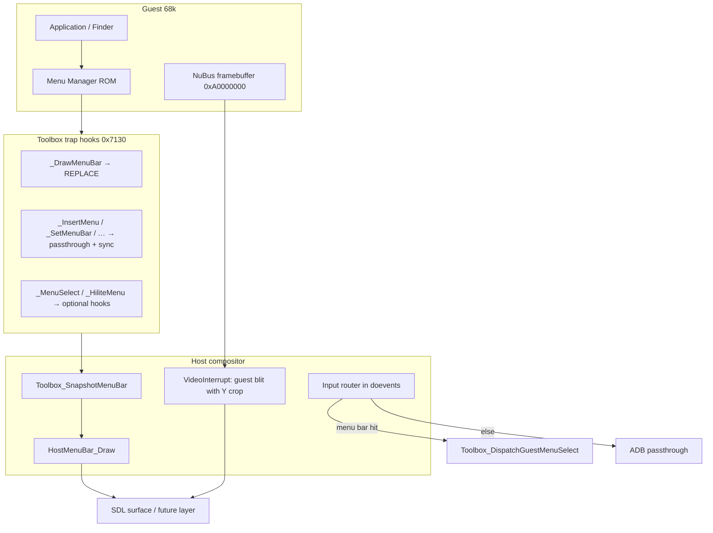

# Classic Menu Bar Compositor (Future)

Design note for restoring a **Classic Mac OS** look and feel in Cockatrice III
by **drawing the menu bar in a host layer** instead of mirroring guest menus
into the native macOS (or Windows) system menu bar.

This document describes work we may land later. It builds on the **Modular
Toolbox Traps** subsystem already in the tree (`toolbox_traps.cpp`,
`M68K_EMUL_OP_TOOLBOX_DISPATCH` / `0x7130`).

**Primary sources today**

| Area | File |
|------|------|
| Toolbox trap registry & dispatch | `BasiliskII/toolbox_traps.cpp`, `BasiliskII/include/toolbox_traps.h` |
| EmulOp routing | `BasiliskII/emul_op.cpp`, `BasiliskII/include/emul_op.h` |
| Guest menu snapshot (MenuList decode) | `Toolbox_SnapshotMenuBar()` in `toolbox_traps.cpp` |
| macOS NSMenu bridge (current approach) | `BasiliskII/bridge/darwin/macos_menu_bridge.mm` |
| SDL video blit & input | `BasiliskII/SDL/video_sdl.cpp` |
| Thread-safe menu commands | `BasiliskII/SDL/menu_bar.cpp`, `BasiliskII/include/menu_bar.h` |
| Inside Mac Menu Manager reference | Menu Manager chapter (MenuInfo, `hMenuCmd`, low-mem globals) |

---

## 1. Goal

Give the emulator a **single composited window** that looks like Classic Mac OS:

- The **menu bar** (Apple, File, Edit, …) is drawn by the **host** from guest
  `MenuList` state, not by ROM `_DrawMenuBar` into the framebuffer and not as
  native `NSMenu` items in the macOS menu bar.
- The **guest desktop** (Finder, apps, windows) continues to render into the
  NuBus framebuffer (`0xA0000000`) and is blitted **below** the host menu strip.
- **Mouse and keyboard** events pass through to the guest unchanged, except
  when the cursor is over the host-drawn menu bar (or an open host-drawn
  dropdown), where the host handles hit-testing and menu selection.

The user sees one Classic-style surface; input routing is transparent.

---

## 2. Why not the current NSMenu bridge?

The existing `macos_menu_bridge.mm` path hooks Menu Manager traps in
**passthrough** mode, snapshots guest `MenuList` (`0x0A1C`), and rebuilds
`NSApp.mainMenu` on the macOS main thread. That works for driving the guest
from the system menu bar but:

- Guest `_DrawMenuBar` still paints into the framebuffer → **double menu** unless
  cropped or suppressed.
- Appearance is **native macOS**, not Chicago / Platinum.
- Coordinate space splits between system menu bar and SDL window.

The compositor approach keeps trap hooks and snapshot logic; only the **output
path** changes (draw into a layer vs. build `NSMenu`).

---

## 3. Architecture overview



**Layer layout (phase 1)**

```
┌──────────────────────────────────────────┐
│ Host menu bar (~20 px, LM_MBarHeight)    │  ← drawn from MacMenuBarSnapshot
├──────────────────────────────────────────┤
│ Guest desktop (framebuffer, Y cropped)   │  ← existing VideoInterrupt blit
└──────────────────────────────────────────┘
```

---

## 4. Toolbox trap strategy

The registry API is in `toolbox_traps.h`:

- `ToolboxTrap_Register(trap, name, handler, user_data)`
- `ToolboxTrap_InstallAll()` — called from `M68K_EMUL_OP_INSTALL_DRIVERS`
- Handler returns `TOOLBOX_ACTION_PASSTHROUGH` or `TOOLBOX_ACTION_REPLACE`
- `ToolboxArgs` — Pascal stack helpers for replace-mode handlers

### 4.1 Menu drawing traps (suppress guest pixels)

| Trap | Name | Future action |
|------|------|----------------|
| `0xA937` | `_DrawMenuBar` | **REPLACE** — set host menu dirty flag; do not run ROM |
| `0xA934` | `_ClearMenuBar` | Passthrough or REPLACE + clear host snapshot |
| `0xA81D` | `_InvalMenuBar` | Invalidate host menu rect only |
| `0xA938` | `_HiliteMenu` | Update highlighted menu title on host layer |

### 4.2 Menu state traps (keep sync, no native NSMenu)

| Trap | Name | Future action |
|------|------|----------------|
| `0xA930` | `_InitMenus` | Passthrough + `Toolbox_RequestMenuBarSync()` |
| `0xA935` | `_InsertMenu` | Same |
| `0xA936` | `_DeleteMenu` | Same |
| `0xA93C` | `_SetMenuBar` | Same |
| `0xA933` | `_AppendMenu` | Same |
| `0xA826` | `_InsertMenuItem` | Same |
| `0xA827` | `_DeleteMenuItem` | Same |

Deferred sync (already implemented): trap pre-hook sets
`Toolbox_RequestMenuBarSync()`; next IRQ runs
`Toolbox_ProcessPendingMenuBarSync()` so ROM finishes updating `MenuList`
before snapshot.

### 4.3 Menu interaction traps (optional, phase 2+)

| Trap | Name | Use |
|------|------|-----|
| `0xA93D` | `_MenuSelect` | Track open menu / item highlight while mouse down |
| `0xA93E` | `_MenuKey` | Usually leave to guest; host may call via stub for shortcuts |
| `0xA9B5` | `_SystemMenu` | Host menu click → `(menuID << 16) \| itemIndex` (see `Toolbox_DispatchGuestMenuSelect`) |

### 4.4 ROM low-memory hooks (alternative / supplement)

Inside Macintosh documents globals the ROM already uses:

| Address | Name | Role |
|---------|------|------|
| `0x0A1C` | `MenuList` | Handle to menu list — source for `Toolbox_SnapshotMenuBar` |
| `0x0A26` | `TheMenu` | Highlighted menu ID |
| `0x0A3C` | `MBarHook` | Menu bar drawing hook proc |
| `0x0A30` | `MenuHook` | `MenuSelect` tracking hook |
| `0x0BAA` | `MBarHeight` | Menu bar height in pixels (typically 20) |

Installing a guest proc on `MBarHook` / `MenuHook` is an alternative to
trapping every draw call; trappable `_DrawMenuBar` REPLACE is simpler for v1.

### 4.5 Window / QuickDraw traps (phase 3+, optional)

Full “Classic window layer” compositing would hook Window Manager and
QuickDraw (e.g. `BeginUpdate`, `InvalWindow`, `CopyBits`). That is **not**
required for the menu bar alone. Defer until menu strip + input routing are
stable.

---

## 5. Host menu renderer (new code, future)

Proposed API (names illustrative):

```c
/* include/host_menu_bar.h */
void HostMenuBar_Init(void);
void HostMenuBar_Invalidate(void);           /* called from trap REPLACE handlers */
void HostMenuBar_Draw(void *surface, int x, int y, int w, int h);
int  HostMenuBar_Height(void);               /* 20 or ReadMacInt16(0x0BAA) */
bool HostMenuBar_HandleMouse(int x, int y, bool down, bool up, bool move);
```

Implementation sketch:

1. On invalidate / deferred sync, call `Toolbox_SnapshotMenuBar()`.
2. Paint menu titles at `MenuList` `leftEdge` coordinates (6-byte entries:
   `MenuHandle` + `leftEdge`).
3. Use Classic styling (white bar, black text, Chicago or host fallback font;
   Apple menu `0x14` →  logo).
4. Respect `enableFlags` (bit 0 = menu; bits 1–31 = items) and `hMenuCmd`
   (`0x1B`) for submenu arrows — do not assign Command-key equivalents to
   submenu items.
5. Phase 2: draw dropdown when tracking; phase 1 can dispatch via
   `Toolbox_DispatchGuestMenuSelect` on title-bar clicks only or synthetic
   `MenuSelect`.

Platform backends:

| Platform | Draw target |
|----------|-------------|
| SDL (all) | Top rows of `SDLscreen` in `VideoInterrupt()` |
| macOS | Same SDL path initially; optional `CGContext` / Metal later |
| Windows | Same SDL path; host File/Disk menus may stay Win32 (`menu_bar_win32.cpp`) |

Replace `Toolbox_SetMenuBarSyncCallback(MacMenuBridge_SyncFromGuest)` with
`HostMenuBar_Invalidate` when this lands.

---

## 6. Video blit adjustment

In `VideoInterrupt()` (`video_sdl.cpp`):

1. Let `mbar_h = HostMenuBar_Height()`.
2. Blit guest framebuffer into `SDLscreen` at **destination Y = `mbar_h`**
   (source unchanged in guest RAM), **or** blit full surface then overdraw
   menu bar.
3. Call `HostMenuBar_Draw(SDLscreen, 0, 0, width, mbar_h)` after guest copy.

Guest ROM may still believe the screen starts at Y=0; only the **host**
presentation offsets the desktop. If apps misbehave, consider adjusting cursor
coordinates in the input router (see below) rather than patching guest globals.

---

## 7. Input passthrough

All SDL events today flow through `doevents()` → `ADBMouseMoved` /
`ADBKeyDown` / `ADBKeyUp` with no region filter (`video_sdl.cpp`).

Future router (pseudocode):

```
mbar_h = HostMenuBar_Height()

SDL_MOUSEMOTION / BUTTONDOWN / BUTTONUP:
  if (y < mbar_h)
    HostMenuBar_HandleMouse(x, y, ...)
    // do not call ADB
  else
    ADBMouseMoved(x, y - mbar_h)   // optional Y adjust
    ADBMouseDown/Up(...)

SDL_KEYDOWN / KEYUP:
  if host dropdown is open
    route arrows / return / escape to host menu controller
  else
    existing kc_decode → ADBKeyDown/Up (unchanged)
```

Menu item activation from host:

- `Toolbox_DispatchGuestMenuSelect(menuID, itemIndex)` — already calls guest
  `_SystemMenu` or `_MenuKey` via small 68k stubs in `toolbox_traps.cpp`.
- Still use `MenuQueue` if UI thread posts commands; IRQ drain on CPU thread.

Command-key shortcuts: **passthrough** to guest; `_MenuKey` in the app handles
them. No host interception needed unless the host dropdown has focus.

---

## 8. Cockatrice host menus vs guest menus

Keep a clear split:

| Menu set | Owner | Future placement |
|----------|--------|------------------|
| File, Disk, Reset, … | Cockatrice emulator | `NSApp.mainMenu` (macOS) or Win32 menu bar — unchanged |
| Apple, File, Edit, … (guest) | Emulated Mac app | Host-drawn strip **inside** SDL window |

Do not merge emulator and guest menus into one native menu bar when Classic
compositing is enabled.

---

## 9. Suggested implementation phases

| Phase | Deliverable |
|-------|-------------|
| **1** | `_DrawMenuBar` REPLACE; crop or overdraw in `VideoInterrupt`; stub `HostMenuBar_Draw` (gray bar + titles) |
| **2** | Input router in `doevents()`; click → `Toolbox_DispatchGuestMenuSelect` |
| **3** | Dropdown tracking (`_MenuSelect` hook or host-side popup); `_HiliteMenu` sync |
| **4** | Classic chrome (font, marks, disabled gray, separators) |
| **5** | Remove or `#ifdef` out `macos_menu_bridge.mm` NSMenu sync when compositor pref is on |
| **6** | (Optional) Window Manager / QuickDraw layer hooks |

Add a preference when implementing, e.g. `classic_menu_bar true`, default off
until phase 2 is stable.

---

## 10. Verification checklist (when implemented)

1. Build: `make -C BasiliskII/OSX64 -j4`
2. Tests: `make -C BasiliskII/tests test`
3. Boot Quadra ROM + disk; confirm `[TOOLBOX-TRAP] Hooked … _DrawMenuBar` and
   no duplicate menu bar pixels in the guest desktop area.
4. Finder loads; host strip shows , File, Edit, View, Special with correct
   titles from `MenuList`.
5. Mouse in desktop region moves guest cursor; clicks reach guest windows.
6. Mouse in menu strip highlights titles; item click runs guest command
   (e.g. About, Quit with shortcut).
7. Command-Q / Command-O still work via guest `_MenuKey` when focus is in
   the emulated desktop.

---

## 11. Relation to existing docs

- Boot and trap install timing: [basilisk-ii-boot-and-patch.md](basilisk-ii-boot-and-patch.md)
  (`InstallDrivers` → `ToolboxTrap_InstallAll`).
- CPU / EmulOp: [cpu-engine-opcode-fixes.md](cpu-engine-opcode-fixes.md).

When implementing, update `AGENTS.md` with a pointer to this file and note
which phase is complete.
